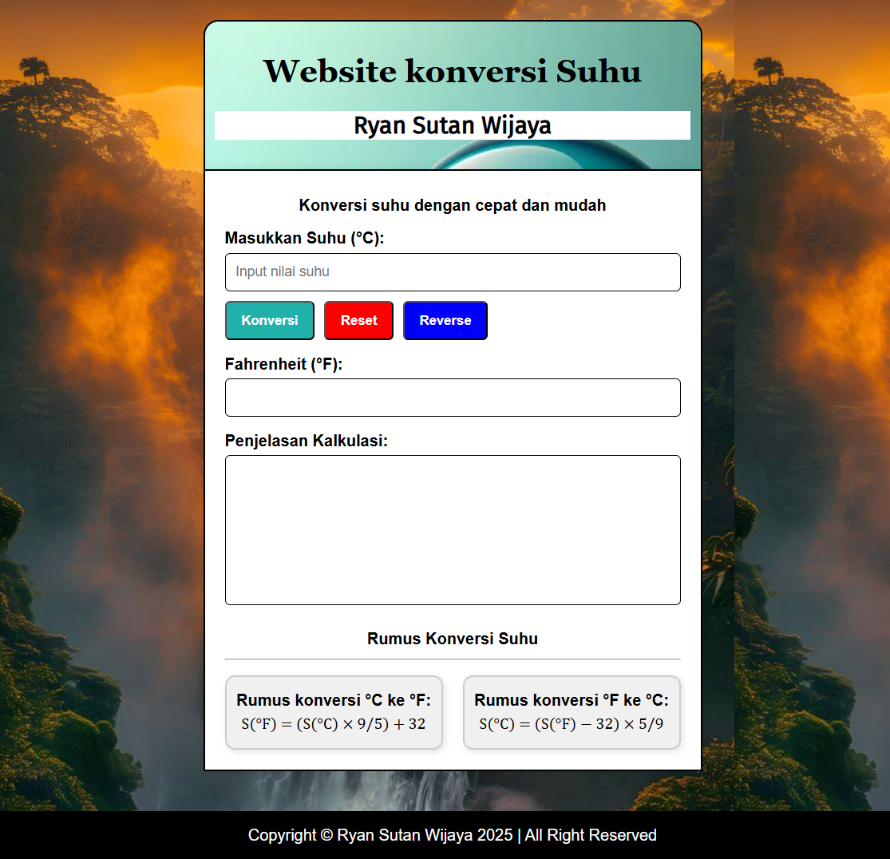

# 🔥 Website Konversi Suhu

Konversi suhu dari Celsius ke Fahrenheit dan sebaliknya secara cepat dan mudah.

## ✨ Fitur

- ✅ Input suhu dalam satuan Celcius atau Fahrenheit
- 🔁 Tombol **Reverse** untuk menukar arah konversi (°C ⇄ °F)
- ♻️ Tombol **Reset** untuk menghapus semua input dan hasil
- 🧠 Penjelasan **langkah-langkah perhitungan**
- 📱 Desain **responsif** untuk tampilan di berbagai ukuran layar
- 🎨 Tampilan bersih, ringan, dan mudah digunakan

### Tampilan Awal

### Tampilan Responsif (Mobile)

## 📁 Struktur Folder

- `index.html`
- `css/style.css`
- `js/script.js`
- `image/` 
- `README.md`

## 👨‍💻 Author

**Ryan Sutan Wijaya**  
📧 [ryanw3312@gmail.com](mailto:ryanw3312@gmail.com)  
🌐 [linkedin.com/in/ryansutan](https://linkedin.com/in/ryansutan)
